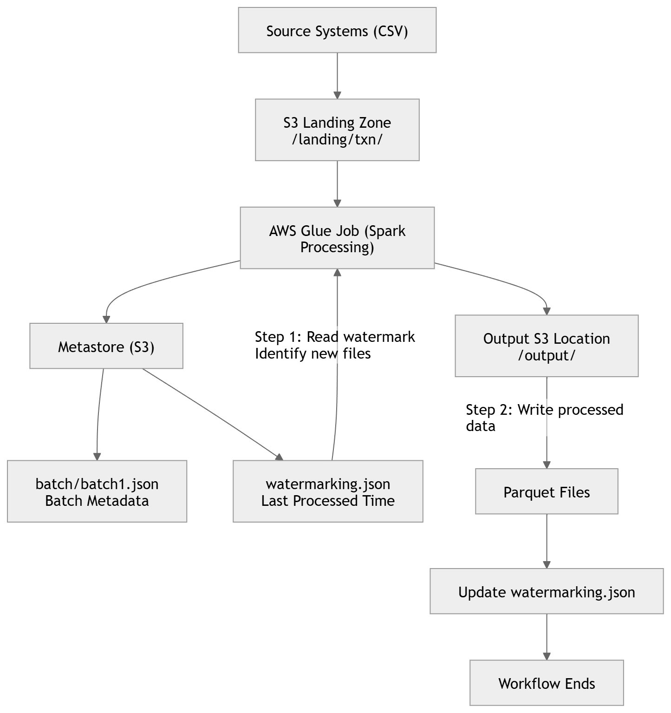

# End-to-End Flow Explanation

# 1. Data Ingestion

Data arrives from source systems (for example, CSV files) and is stored in the landing zone in Amazon S3.

Example path:

s3://landing-bucket/workflow-1/txn/
# 2. Metadata and Incremental Setup (Job A)

An AWS Glue job (Job A) is responsible for preparing the run.

First, it creates a batch metadata file for the current execution. This file contains details like batch id, execution time, and status.

Example:

s3://landing-bucket/metastore/workflow-1/batch/batch.json

Next, the job reads the watermark file to understand what was processed in the previous run.

Example:

s3://landing-bucket/metastore/workflow-1/watermarking.json

Sample content:

{
  "last_processed_time": "2026-04-29T10:44:54.474872+00:00"
}

Using this timestamp, the job scans the landing path and identifies only the new files (files with timestamp greater than the watermark).

The list of these new files is prepared and passed to the next job (or kept in memory depending on the workflow design).

# 3. Data Processing (Job B)

A second AWS Glue job (Job B) takes the list of new files and processes them.

This job:

Reads only the filtered files
Applies required transformations (cleaning, validation, derived columns, etc.)
Converts the data into the required output format
# 4. Data Write

The processed data is written to the curated/output location in Amazon S3.

Example:

s3://bucket/output/

In the current approach, data is written directly to the output path.

1. Watermark Update

After successful completion of Job B, the watermark file is updated with the latest processed timestamp.

This ensures that in the next run, only new data will be picked up.

